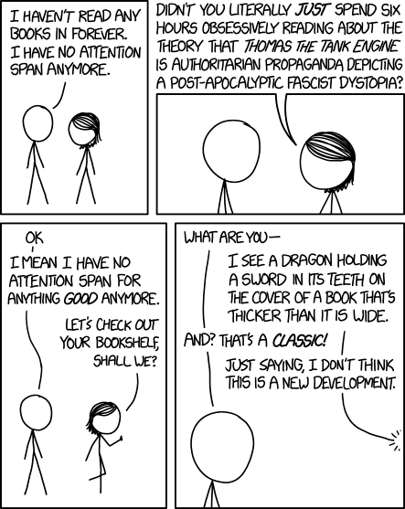
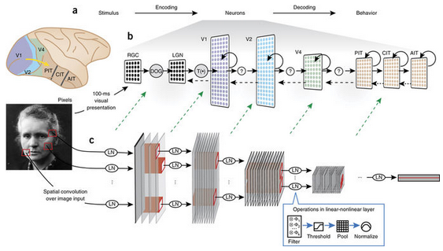
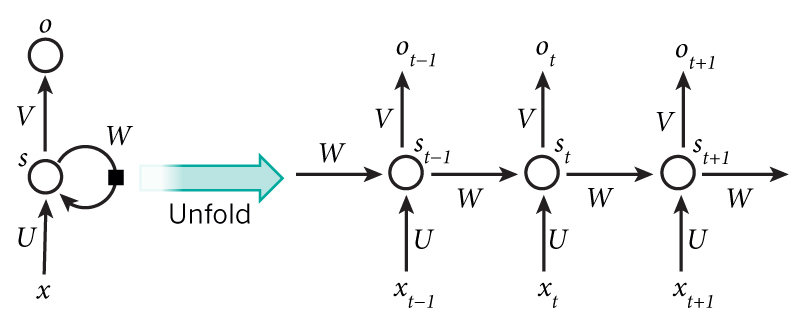
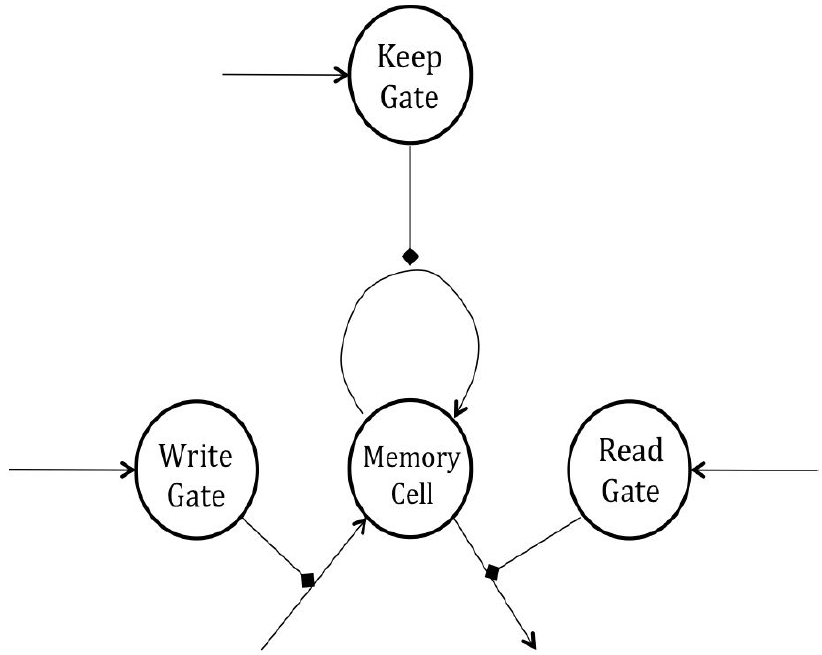

# Text Classification using CNNs and RNNs

## Human interpretation of text

When a human like you or me or anyone is given a piece of text, we read it word by word left to right top to bottom.

As we span through a sentence, we remember the previous words upto a certain length and every subsequent word in a sentence helps us understand more about that word and many others which occurred before it. Based on the task at hand, we forget the sentence we read as we go to a new one or keep it in our memory to connect it with something later.

This is a supremely complex task to ask a Computer to do because there's reading, writing, erasing of memory and simultaneously interpretation of the sentences which are read before. The human brain surely needs to be credited to do such tasks so effortlessly and yet not boast of it's capabilities. 

[Image Source](https://www.explainxkcd.com/wiki/images/e/e4/attention_span.png)

## Human interpretation of images

When we see an image, we observe it all at once (well, if it's too big we observe it in parts but let's roll with the overall viewing hypothesis for now). That's how evolution worked it's way out and figured vision to be best optimized when we do it this way. There's a bunch of neurons which are locally connected and they're in turn connected locally to another higher layer which are connected to another higher layer and so on and it helps us comprehend images much faster and in a much more generalized way than having all neurons connected to all other neurons. 

After [Huber and Wiesel figured this out](https://knowingneurons.com/2014/10/29/hubel-and-wiesel-the-neural-basis-of-visual-perception/), taking inspiration from the working of a human brain's visual cortex, CNNs were built to make computers understand images and it did work wonders!

[Image Source](https://knowingneurons.com/2014/10/29/hubel-and-wiesel-the-neural-basis-of-visual-perception/)

The image above gives a brief understanding of how the idea for CNNs was inspired by the functioning of vision in human brain.

**Why CNNs generally don't tend to do better at text classification and the need for a better architecture or a better representation is justified?**

## Images vs text

From the above discussions it could be observed that the primary difference which makes text difficult to deal with compared to images is the way it's interpreted. Both of them images and text have spatial dependencies but **in text, there are prominent long and short term dependencies which in images is mostly not the case.**

Also, images, an image by itself as a combination of pixels doesn't need to be analyzed conditionally at every pixel level. What I mean by that is, we check for patterns in an image and if we find them it's a match otherwise it's not. But in text, where words are analogous to pixels (quantum of study), a word which appears now may influence a word which appears 100 words down the line. 

For eg. If I say I grew up in Mumbai and follow it up stories from my childhood for the next 100 words and then I say I speek fluent \__________, the language that fills the blank depends on where I grew up which appeared 100 words before in the text.

This is very difficult and not so efficient to do with CNNs. We will have to have different sized kernels in a single layer for capturing these dependencies but how many such kernels would be needed? 

They will exponentially explode by the time we reach 2nd layer or so.

Even if we take huge kernels all homogeneous, it will not serve the our purpose because the model will simply have too much capacity and it'll overfit.

 CNN can therefore only capture short term dependencies with small window/filter sizes in this context. We will now look at an architecture which overcomes this problem. 
 
 
## RNN (Recurrent Neural Networks)

As we saw in the previous notebook, CNNs do not handle a stream of data sequentially but looks at it all at once. This is not the way we humans are used to dealing with sequential inputs like text. We overcome that issue by building something known as a recurrent neural network.

This network's hidden layer has a connection to itself (hence the name recurrent). What this means is that the activation for a word that comes second is a function of the activation of the first word in addition to the input word itself. This helps us capture the representation of effect of old words on new words and the meaning is grasped much better just like in the case of human understanding.

This concept can be well understood from the following diagram of time unfoldment of an RNN below.

[Image Source](https://www.researchgate.net/profile/Subburam_Rajaram/publication/324680970/figure/fig1/AS:617962817986561@1524345225985/A-recurrent-neural-network-and-the-unfolding-in-time-of-the-computation-involved-in-its.png)

The output may or may not be present at each time step but other units are intact.

In every recurrent layer, the neurons are fully connected to themselves i.e. if we have 3 neurons in a hidden layer, we'll have 3 * 3 = 9 connections within the layer itself. There's of course a time shift i.e. in the first pass, we'll have a simple hidden layer but in the second pass, the output activations from the first pass will be influencing the outputs of the second pass and so on.

**Shortcomings of an RNN**

If you look at the architecture and the learning that happens using BPTT(Backpropagation Through Time), you'll realize that the task will be influenced more by the later layers in the sequence than the previous layers. 

As one goes deeper, the contribution of the previous neuron to the output decreases due to continuous thresholding and the compounding effect of the same. Because of this problem in forward propagation, error back-propagation also goes through a similar problem where the weight updates are hardly influenced by the words that came earlier in the sequence than those which came later. 

## LSTM

LSTM, short for Long Short Term Memory solves this problem which we're facing above. It basically says, let's add connections from the layers in the past to those in the future (orderwise), and let the neural network learn which connections are strong and keep'em and forget the other ones. 

It's quite similar to how we perceive textual information as well. When we read a passage, we do it word by word. Also, if we're given a task, we tune our memory in accordance with the task.

Let's say we're given a passage about the effects of global warming over the past 40 years and we're asked a question "How did global warming affect marine ecosystems in 1984? Which events were key in the tragedy that took place?"

In order to answer that question, we'd start reading the passage and have an eye out on the word 1984 and anything that happened in that period. As we read along sentence by sentence, we'd most likely retain sentences which deal with things that happened in 1984 and forget the sentences which don't. In LSTM, to implement such an architecture, we use gates.

- Write Gate (Input Gate) - Decides whether the incoming input should be considered or not.
- Memorory Gate (Forget Gate) - Decides whether to retain the memory in subsequent step.
- Read Gate (Output Gate) - Controls the flow of information from one cell to another

The values of these gates are also learned by Neural Network and they're sigmoid activated which means they're real valued between 0 and 1. They need not necessarily be just on or off. 

There is another method to implement an RNN to do the same thing which LSTM does and it's called GRU (Gated Recurrent Unit). It is simpler than an LSTM and hence many applications which previously used LSTM are nowadays being replaced by GRUs.

## Agenda

### CNN_Text_Classification.ipynb
**Demonstrate use of CNN for text classification using keras with tensorflow as backend**

I will be using a dataset containing text belonging to three categories: spam, ham and info.

*Spam* -[Wikitionery defines Spam as](https://en.wikipedia.org/wiki/Spamming) the use of electronic messaging systems to send unsolicited bulk messages, especially advertising, indiscriminately

*Ham* - [Wikitionery defines it as](https://en.wiktionary.org/wiki/ham_e-mail) E-mail that is generally desired and isn't considered spam.

Info is self explanatory.

### IMDB_Movie_Review_Classification_LSTM.ipynb
Build a simple LSTM model to perform movie review analysis in keras' preloaded datasets. Understand the hyperparameters of an LSTM model.
